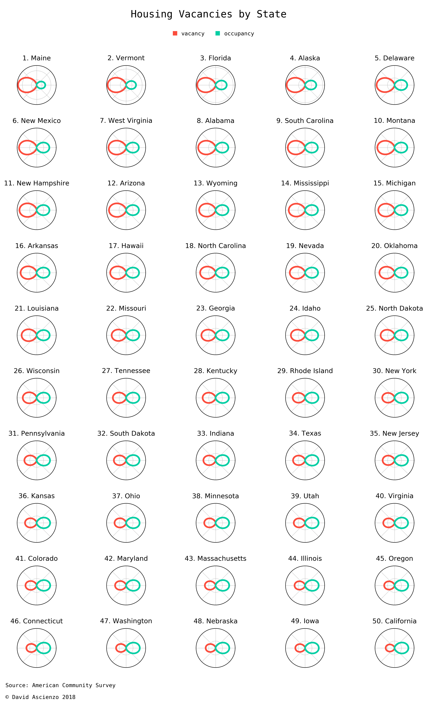
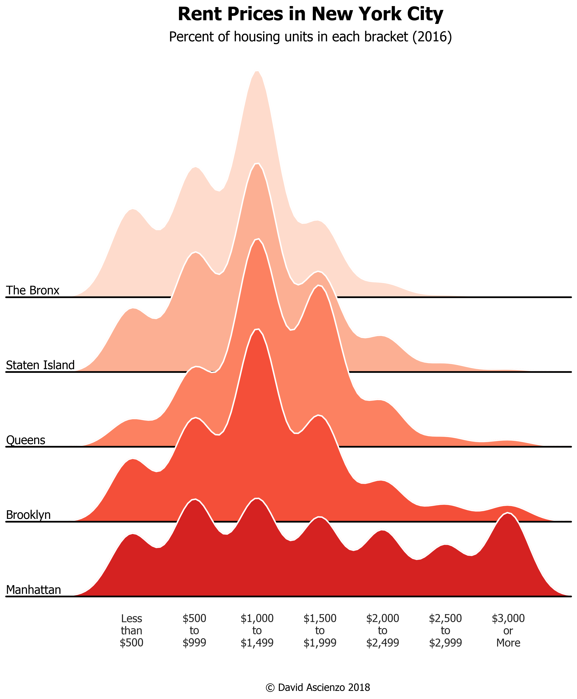

This repo contains my data visualizations.

 

## Housing Vacancies by State
---

You can check out the code [here](us-census-housing/Housing_Vacancy_Polarplots.ipynb)!

 

## Home Value and Rent Prices in NYC Boroughs
---

 

You can check out the code [here](us-census-housing/NYC_Housing_Joyplots.ipynb)!